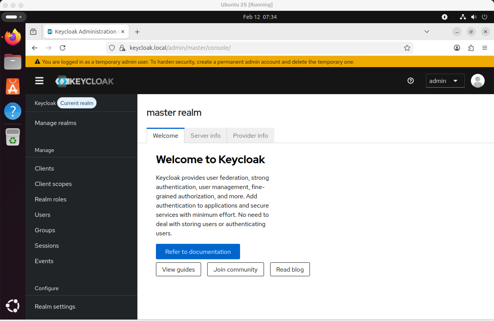
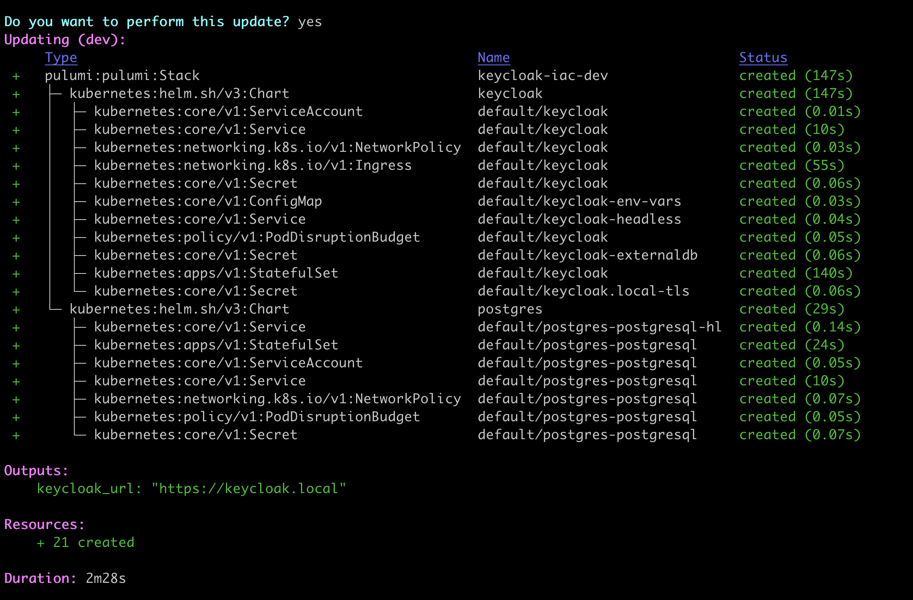

# 🛡️ Keycloak Deployment on RKE2 using Pulumi (IaC)

### Submission Repository

This repository contains a fully reproducible Infrastructure as Code (IaC) setup to deploy:

* A single-node **RKE2 Kubernetes cluster**
* **PostgreSQL** as external database
* **Keycloak** deployed via Pulumi (Python)
* **NGINX Ingress**
* **Self-signed TLS** for HTTPS access



---

# 🏗 Architecture Overview

| Layer          | Implementation            |
| -------------- | ------------------------- |
| Kubernetes     | RKE2 (single-node) over VM        |
| Provisioning   | Ansible                   |
| IaC Deployment | Pulumi (Python)           |
| Database       | PostgreSQL (Bitnami Helm) |
| Identity       | Keycloak (Bitnami Helm)   |
| Ingress        | NGINX Ingress             |
| TLS            | Self-Signed Certificate   |

---

# ⚙️ Setup Instructions

---

## Prerequisites

### Local Machine

* Ansible installed
* Pulumi (Python runtime)
* kubectl
* SSH access to VM

### Target VM

- Ubuntu 24.04 / 25.04
- Minimum 2 CPU & 4GB Memory
- Python3 installed
- Ports open:
  * `6443` (Kubernetes API)
  * `80` (HTTP)
  * `443` (HTTPS)

> ⚠️ RKE2 will be deployed on a dedicated Ubuntu VM rather than a local container-based cluster (e.g., Kind or k3d) because RKE2 is a full Kubernetes distribution designed to run on a Linux host with system-level components (systemd, containerd, CNI, iptables) and is not supported to run inside containers.

> Using a VM enables full OS-level automation with Ansible, demonstrates RKE2’s host-based security capabilities, and provides realistic Ingress and HTTPS handling through direct binding of ports 80 and 443.


---

## Step 1: Bootstrap RKE2 Cluster (Ansible)

Clone the repository:

```bash
git clone <repo-url>
```

### Step 1.1 Update Inventory

Edit:

```ini
cd keycloak-rke2-iac/rke2-bootstrap
vim rke2-bootstrap/inventory/hosts.ini
```

Example:

```ini
[rke2]
rke2-master ansible_host=<VM-IP> ansible_port=22

[rke2:vars]
ansible_user=<vm-username>
ansible_become=true
ansible_python_interpreter=/usr/bin/python3
ansible_ssh_private_key_file=<private-key-path>
```

### Step 1.2 Run Playbook to bootstrap the cluster

```bash
ansible-playbook playbooks/rke2-install.yml
```

This installs:

* RKE2 server
* kubeconfig
* Enables and starts the service
* Setup kubeconfig on local to connect with the RKE2 Cluster

---

## Step 2: Deploy Application Stack (Pulumi)

### Step 2.1: Configure the KUBECONFIG:

```bash
export KUBECONFIG=~/.kube/config-rke2
kubectl get nodes
```

You should see the RKE2 node ready on local.


### Step 2.2: Navigate to Pulumi directory:

```bash
cd keycloak-rke2-iac/pulumi
```

### Step 2.3: Login locally:

```bash
pulumi login --local
```

### Step 2.4: Set Kubernetes config:

```bash
pulumi config set kubernetes:configPath ~/.kube/config-rke2
```

### Step 2.5: Set database password securely:

```bash
pulumi config set dbPassword --secret
```

### Step 2.6: Deploy:

```bash
pulumi up
```

Pulumi will deploy:

* PostgreSQL
* Keycloak
* Ingress
* TLS Secret



---

## Step 3: Access Keycloak

### Step 3.1: Configure the domain on local
Because we are using a custom hostname (`keycloak.local`), update your local hosts file:

### Linux / Mac

```bash
sudo vim /etc/hosts
```

### Windows (Run as Admin)

```
C:\Windows\System32\drivers\etc\hosts
```

Add:

```
<VM-IP> keycloak.local
```

---

## 🌐 Access URL

```
https://keycloak.local
```

> ⚠️ Since we are using a self-signed certificate, your browser will show a security warning.
> Click **Advanced → Proceed to keycloak.local (unsafe)**.

---

# 🔐 Keycloak Login Credentials

| Field    | Value                       |
| -------- | --------------------------- |
| Username | `admin`                     |
| Password | Retrieved via Pulumi secret |

To retrieve the admin password:

```bash
kubectl get secret keycloak -o jsonpath='{.data.admin-password}' | base64 --decode
```

---

# 📌 Assumptions & Notes

* Single-node RKE2 cluster for simplicity.
* Persistence disabled for PostgreSQL (can be enabled for production).
* Self-signed TLS used for local secure access.
* Designed for reproducibility via IaC (Pulumi).
* Not production-hardened (no HA, no backup, no monitoring stack).

---

# ⏱ Total Time Spent

Approximately **6 hours**, including:

* Infrastructure bootstrap
* Pulumi stack development
* Ingress + TLS configuration
* Testing & debugging
* Documentation

---

# 🧹 Cleanup

To remove application stack:

```bash
pulumi destroy
```

To remove RKE2:

```bash
ansible-playbook playbooks/rke2-uninstall.yml
```

---

# Summary

This repository demonstrates:

* Infrastructure as Code principles
* Secure cluster bootstrap
* External database integration
* TLS-enabled ingress
* Reproducible deployment
* Clean documentation and operational workflow
